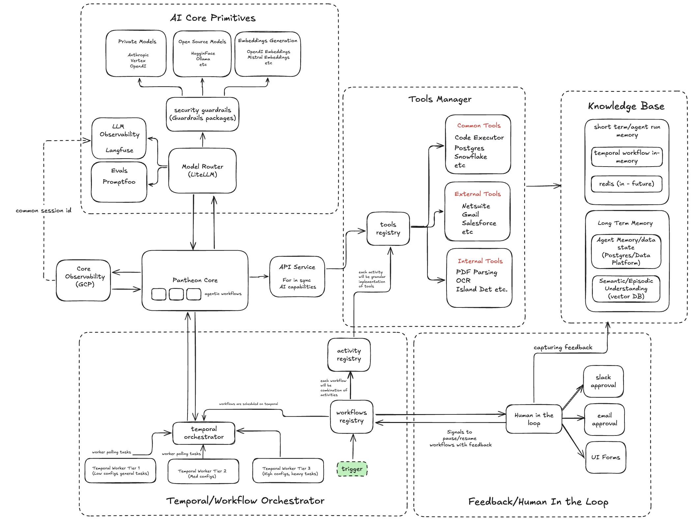

# Pantheon V2

## Project Overview and Purpose

Pantheon V2 is a comprehensive AI orchestration platform designed to create, manage, and execute workflows using Large Language Models (LLMs) and Temporal. The platform provides a structured way to build AI-powered applications by combining various tools, activities, and workflows into cohesive processes.

The system is built around a core architecture that enables:
- Orchestration of AI workflows using Temporal
- Integration with various AI models (OpenAI, Anthropic, etc.)
- Modular tool development for common operations
- Observability and monitoring of AI operations
- Human-in-the-loop feedback mechanisms

Pantheon V2 serves as the foundation for building AI agents that can perform complex tasks by combining multiple tools and capabilities in a reliable, observable, and maintainable way.

## System Architecture



The architecture diagram illustrates the key components of Pantheon V2:

### AI Core Primitives
The top section shows the AI core primitives, which include:
- **Private Models**: Integration with proprietary AI models like Anthropic, Vertex, and OpenAI
- **Open Source Models**: Support for open-source models like HuggingFace, Ollama, etc.
- **Embeddings Generation**: Services for creating embeddings using OpenAI, Mistral, and other embedding models

These components are secured through **Security Guardrails** (Guardrails packages) and accessed via the **Model Router** (LiteLLM).

### LLM Observability
The system includes observability tools:
- **LangFuse**: For tracking and analyzing LLM interactions
- **Evals**: For evaluating model performance using PromptFoo

### Core Components
The central part of the architecture shows:
- **Pantheon Core**: The main orchestration engine with specific workflows
- **Core Observability (GCP)**: Monitoring and logging infrastructure
- **API Service**: Exposes in-sync AI capabilities

### Tools Manager
The right section shows the tools management system:
- **Common Tools**: Code Executor, Postgres, Snowflake, etc.
- **External Tools**: Netsuite, Gmail, Salesforce, etc.
- **Internal Tools**: PDF Parsing, OCR, Island Detection, etc.
- **Tools Registry**: Central registry for tool discovery and implementation

### Knowledge Base
The knowledge storage system includes:
- **Short Term/Agent Run Memory**: For temporary storage during agent execution
- **Temporal Workflow In-Memory**: For workflow state management
- **Redis (Future)**: Planned for caching and state management
- **Long Term Memory**: For persistent storage of agent data and state
- **Semantic/Episodic Understanding**: Vector database for semantic search

### Temporal/Workflow Orchestrator
The bottom left shows the workflow orchestration system:
- **Temporal Orchestrator**: Manages workflow execution
- **Temporal Workers**: Different tiers for various task complexities
- **Workflows Registry**: Central registry for workflow discovery
- **Activity Registry**: Registry for individual activities

### Feedback/Human In the Loop
The bottom right shows human interaction components:
- **Human in the Loop**: Interface for human oversight
- **Approval Mechanisms**: Slack, email, and UI forms for approvals
- **Workflow Feedback**: System for capturing and incorporating human feedback

## Directory Structure and Component Explanations

### `/api`
Contains FastAPI routers and middleware for the web service.

**Use Cases:**
- Adding new API endpoints
- Implementing API middleware
- Defining API routes and handlers

**When to Use:**
- When creating new API endpoints for external services to interact with Pantheon
- When implementing new API features or middleware

### `/core`
Contains core functionality for the Pantheon system.

**Key Subdirectories:**
- `/actions`: Core action implementations
- `/common`: Shared utilities and helpers
- `/custom_data_types`: Custom data type definitions
- `/errors`: Error handling and definitions
- `/evals`: Evaluation frameworks for LLMs
- `/modelrouter`: LLM routing and management
- `/prompt`: Prompt management and templates
- `/temporal`: Temporal workflow integration

**Use Cases:**
- Implementing core system functionality
- Managing LLM interactions
- Handling workflow orchestration

**When to Use:**
- When extending core system capabilities
- When implementing new model integrations
- When working with Temporal workflows at a low level

### `/processes`
Contains workflow definitions and implementations.

**Key Subdirectories:**
- `/common`: Shared workflows used across the system
- `/core`: Core workflow functionality
- `/customers`: Customer-specific workflow implementations
- `/integration_tests`: Tests for workflow integrations
- `/platform`: Platform-specific workflows

**Use Cases:**
- Defining new workflows
- Implementing customer-specific processes
- Creating reusable workflow components

**When to Use:**
- When creating new business processes
- When implementing customer-specific workflows
- When extending existing workflow capabilities

### `/tools`
Contains tool implementations that activities can use.

**Key Subdirectories:**
- `/common`: Common tools used across the system (PDF parsing, OCR, etc.)
- `/core`: Core tool functionality and registries
- `/external`: Tools for external service integration (GCS, Gmail, etc.)

**Use Cases:**
- Implementing new tools for activities to use
- Integrating with external services
- Creating reusable tool components

**When to Use:**
- When adding new capabilities that activities can leverage
- When integrating with external services
- When implementing common functionality needed across workflows

### `/settings`
Contains configuration settings for the application.

**Use Cases:**
- Managing environment-specific configuration
- Defining system-wide settings

**When to Use:**
- When adding new configuration parameters
- When modifying system behavior based on environment

### `/utils`
Contains utility functions and helpers.

**Use Cases:**
- Implementing shared utility functions
- Creating helper methods for common operations

**When to Use:**
- When implementing functionality needed across multiple components
- When creating helper methods for common tasks

## Key Function References and Examples

### Workflow Registration

```python
from pantheon_v2.processes.core.registry import WorkflowRegistry
from pydantic import BaseModel

class MyWorkflowInput(BaseModel):
    input_param: str

class MyWorkflowOutput(BaseModel):
    result: str

@WorkflowRegistry.register_workflow_defn(
    "My custom workflow description", labels=["custom"]
)
class MyWorkflow:
    @WorkflowRegistry.register_workflow_run
    async def execute(self, input_data: MyWorkflowInput) -> MyWorkflowOutput:
        # Workflow implementation
        return MyWorkflowOutput(result="Processed: " + input_data.input_param)
```

### Tool Implementation

```python
from pantheon_v2.tools.core.tool_registry import ToolRegistry
from pantheon_v2.tools.core.base import BaseTool
from pydantic import BaseModel

class MyToolInput(BaseModel):
    param1: str
    param2: int

class MyToolOutput(BaseModel):
    result: str

@ToolRegistry.register_tool(description="My custom tool description")
class MyTool(BaseTool):
    def __init__(self, config: dict):
        self.config = config

    async def initialize(self) -> None:
        # Initialize tool resources
        pass

    @ToolRegistry.register_tool_action(description="Perform a custom action")
    async def my_action(self, params: MyToolInput) -> MyToolOutput:
        # Tool action implementation
        return MyToolOutput(result=f"Processed: {params.param1}, {params.param2}")
```

### Activity Implementation

```python
from pantheon_v2.tools.core.activity_registry import ActivityRegistry
from my_tool import MyTool, MyToolInput, MyToolOutput

@ActivityRegistry.register_activity("Perform my custom activity")
async def my_activity(input: MyToolInput) -> MyToolOutput:
    # Config should be loaded from environment variables or secure storage
    # NOT passed as input parameters to avoid security and compliance issues
    config = get_secure_config()  # Load from secure source
    tool = MyTool(config)
    await tool.initialize()
    return await tool.my_action(input)
```

**Important Security Principle:** Always use a single input parameter for activities following Temporal standards. Never pass configuration or credentials via activity inputs since all inputs are stored by Temporal, which can cause serious compliance and security issues with sensitive credentials.

### Using Activities in Workflows

```python
from datetime import timedelta
from temporalio import workflow
from pydantic import BaseModel, Field
from pantheon_v2.processes.core.registry import WorkflowRegistry
from pantheon_v2.tools.external.salesforce.models import (
    SalesforceQueryInput,
    SalesforceQueryOutput,
    SalesforceUpdateInput,
    SalesforceUpdateOutput,
)
from pantheon_v2.tools.common.data_transformer.models import (
    DataTransformerInput,
    DataTransformerOutput,
)

# Import activities, passing them through the sandbox without reloading
with workflow.unsafe.imports_passed_through():
    import structlog
    from pantheon_v2.tools.external.salesforce.activities import (
        salesforce_query,
        salesforce_update,
    )
    from pantheon_v2.tools.common.data_transformer.activities import transform_data

    logger = structlog.get_logger(__name__)


class CustomerDataProcessingInput(BaseModel):
    """Input for customer data processing workflow."""
    account_id: str = Field(..., description="Salesforce account ID to process")
    update_fields: dict = Field(..., description="Fields to update in the account")


class CustomerDataProcessingOutput(BaseModel):
    """Output from customer data processing workflow."""
    account_data: dict = Field(..., description="Processed account data")
    update_status: str = Field(..., description="Status of the update operation")
    processing_summary: dict = Field(..., description="Summary of processing steps")


@WorkflowRegistry.register_workflow_defn(
    "Process customer data from Salesforce",
    labels=["customer", "salesforce", "data_processing"]
)
class CustomerDataProcessingWorkflow:
    @WorkflowRegistry.register_workflow_run
    async def execute(self, input_data: CustomerDataProcessingInput) -> CustomerDataProcessingOutput:
        # Step 1: Query customer data from Salesforce
        query_result = await workflow.execute_activity(
            salesforce_query,
            args=[
                SalesforceQueryInput(
                    query=f"SELECT Id, Name, Industry, AnnualRevenue FROM Account WHERE Id = '{input_data.account_id}'"
                )
            ],
            start_to_close_timeout=timedelta(minutes=2),
        )

        if not query_result.records:
            raise ValueError(f"Account with ID {input_data.account_id} not found")

        account_data = query_result.records[0]

        # Step 2: Transform the data using a data transformer
        transformed_data = await workflow.execute_activity(
            transform_data,
            args=[
                DataTransformerInput(
                    data=account_data,
                    transformation_rules={
                        "revenue_category": "categorize_by_revenue(AnnualRevenue)",
                        "industry_group": "map_industry_to_group(Industry)"
                    }
                )
            ],
            start_to_close_timeout=timedelta(minutes=1),
        )

        # Step 3: Update the account with processed data and user-provided fields
        update_fields = {**input_data.update_fields, **transformed_data.transformed_data}

        update_result = await workflow.execute_activity(
            salesforce_update,
            args=[
                SalesforceUpdateInput(
                    object_type="Account",
                    record_id=input_data.account_id,
                    fields=update_fields
                )
            ],
            start_to_close_timeout=timedelta(minutes=2),
        )

        # Return comprehensive output with processing details
        return CustomerDataProcessingOutput(
            account_data=account_data,
            update_status="success" if update_result.success else "failed",
            processing_summary={
                "fields_updated": list(update_fields.keys()),
                "transformations_applied": list(transformed_data.transformed_data.keys()),
                "timestamp": update_result.timestamp
            }
        )
```

## Key Design Principles and Guidelines

### 1. Tool and Activity Relationship

**Important:** Workflows should never directly access tools. All tool interactions must be done through activity wrappers.

- Tools encapsulate functionality, but activities provide the interface for workflows
- Every tool action must have a corresponding activity wrapper
- Activities initialize tools, execute their actions, and handle the results
- Activities are idempotent, retryable functions that provide reliability through Temporal's retry mechanisms
- Activities should always return Pydantic BaseModel objects for type safety and consistency

This structure is essential because activities are designed as idempotent functions that can be retried by Temporal automatically, providing much greater reliability for your workflows. If a tool operation fails, Temporal can retry the activity without affecting the workflow state.

```python
# Tool implementation
@ToolRegistry.register_tool(description="Google Cloud Storage tool for file operations")
class GCSTool(BaseTool):
    def __init__(self, config: dict):
        self.storage_client = None
        self.config = config

    async def initialize(self) -> None:
        """Initialize the GCS client asynchronously"""
        try:
            config = GCSConfig(**self.config)
            self.storage_client = storage.Client(config.project_id)
            logger.info("GCS tool initialized successfully")
        except Exception as e:
            logger.error("Failed to initialize GCS tool", error=str(e))
            raise

    @ToolRegistry.register_tool_action(
        description="Download a file from Google Cloud Storage"
    )
    async def download_from_gcs(
        self, params: DownloadFromGCSInput
    ) -> DownloadFromGCSOutput:
        bucket = self.storage_client.get_bucket(params.bucket_name)
        blob = bucket.blob(params.file_name)
        bytes_buffer = BytesIO()
        blob.download_to_file(bytes_buffer)
        bytes_buffer.seek(0)
        return DownloadFromGCSOutput(content=bytes_buffer)

# Activity wrapper
@ActivityRegistry.register_activity("Download a file from Google Cloud Storage")
async def download_from_gcs(
    config: GCSConfig, input: DownloadFromGCSInput
) -> DownloadFromGCSOutput:
    tool = GCSTool(config)
    await tool.initialize()
    return await tool.download_from_gcs(input)

# Using the activity in a workflow
@WorkflowRegistry.register_workflow_run
async def execute(self, input_data: MyWorkflowInput) -> MyWorkflowOutput:
    # Use activity to access tool functionality
    result = await WorkflowRegistry.execute_activity(
        activity_params=ActivityParams(
            activity_name="download_from_gcs",
            return_type=DownloadFromGCSOutput
        ),
        config=GCSConfig(...),
        input=DownloadFromGCSInput(...)
    )

    return MyWorkflowOutput(result=result.content)
```

### 2. Business Logic vs. Tools

**Important:** Tools should only be created for generic, reusable functionality. Business logic should be implemented separately.

- Create tools only for generic operations (file handling, API interactions, etc.)
- For customer-specific or specialized logic, use business logic functions
- Business logic can be defined in the workflow or in separate modules

```python
# Business logic function example
async def execute_column_mapping(
    input_data: Union[dict, ColumnMappingInput],
) -> ColumnMappingOutput:
    """
    Execute column mapping using LLM to map between source and target formats.

    Args:
        input_data: ColumnMappingInput containing source and target DataFrames

    Returns:
        ColumnMappingOutput containing the mapping results
    """
    try:
        # Convert dict to ColumnMappingInput if necessary
        if isinstance(input_data, dict):
            input_data = ColumnMappingInput(**input_data)

        # Load source DataFrame
        source_df = pd.read_json(input_data.source_df, orient="split")

        # Check and fix numeric headers in source DataFrame
        headers = list(source_df.columns)
        are_headers_numeric = all(
            isinstance(h, (int, float)) or (isinstance(h, str) and h.isdigit())
            for h in headers
        )
        if are_headers_numeric:
            new_headers = source_df.iloc[0].tolist()
            source_df.columns = new_headers
            source_df = source_df.iloc[1:].reset_index(drop=True)

        # Prepare context for both source and target tables
        source_context = prepare_table_context(
            input_data.source_df, input_data.sample_rows
        )
        target_context = prepare_table_context(
            input_data.target_df, input_data.sample_rows
        )

        # Get mapping suggestions from LLM
        mapping_result = await get_column_mapping_from_llm(
            source_context, target_context
        )

        # Apply the mapping and return results
        return apply_column_mapping(source_df, mapping_result)
    except Exception as e:
        logger.error("Error executing column mapping", error=str(e))
        raise

# Using business logic in a workflow with code executor activity
@WorkflowRegistry.register_workflow_run
async def execute(self, input_data: TableDetectionInput) -> TableDetectionOutput:
    # Get data using an activity
    source_df = await workflow.execute_activity(
        download_from_gcs,
        args=[
            GCSConfig(...),
            DownloadFromGCSInput(...)
        ],
        start_to_close_timeout=timedelta(minutes=1),
    )

    # Apply business logic using code executor activity
    column_mapping_result = await workflow.execute_activity(
        execute_code,
        args=[
            CodeExecutorConfig(timeout_seconds=30),
            ExecuteCodeParams(
                function=get_fqn(execute_column_mapping),
                args=(
                    ColumnMappingInput(
                        source_df=source_df.content,
                        target_df=target_template,
                        sample_rows=3
                    ).dict(),
                ),
            ),
        ],
        start_to_close_timeout=timedelta(minutes=1),
    )

    # Store results using another activity
    await workflow.execute_activity(...)

    return TableDetectionOutput(result=column_mapping_result.result)
```

### 3. Actions Hub for Autonomous Agents

The Actions Hub provides a unified interface for autonomous agents to access activities, workflows, and business logic.

```python
from pantheon_v2.tools.core.activity_registry import ActivityRegistry
from pantheon_v2.processes.core.registry import WorkflowRegistry
from pantheon_v2.core.actions.models import Action, ActionFilter, ActionType
from pantheon_v2.tools.common.code_executor.config import CodeExecutorConfig
from pantheon_v2.tools.common.code_executor.models import ExecuteCodeParams


class ActionsHub:
    @classmethod
    def get_available_actions(cls, filters: ActionFilter) -> list[Action]:
        actions = []
        workflows = WorkflowRegistry.get_available_workflows(filters.labels)
        for workflow in workflows:
            actions.append(Action.from_workflow(workflow))

        for activity in ActivityRegistry.get_available_activities():
            actions.append(Action.from_activity(activity))

        return [
            action for action in actions if action.name in filters.resticted_action_set
        ]

# Action model implementation
class Action(BaseModel):
    name: str
    description: str
    parameters: dict[str, type]
    returns: type
    long_description: str | None = None
    action_type: ActionType

    @classmethod
    def from_workflow(cls, workflow: Workflow) -> "Action":
        return cls(
            name=workflow.name,
            description=workflow.description,
            parameters=workflow.parameters,
            returns=workflow.returns,
            long_description=workflow.func.__doc__,
            action_type=ActionType.WORKFLOW,
        )

    @classmethod
    def from_activity(cls, activity: Activity) -> "Action":
        return cls(
            name=activity.name,
            description=activity.description,
            parameters=activity.parameters,
            returns=activity.returns,
            long_description=activity.func.__doc__,
            action_type=ActionType.ACTIVITY,
        )

    async def execute(self, **kwargs) -> Any:
        if self.action_type == ActionType.ACTIVITY:
            return await WorkflowRegistry.execute_activity(
                ActivityParams(activity_name=self.name, return_type=self.returns),
                **kwargs,
        elif self.action_type == ActionType.BUSINESS_LOGIC:
            # Execute business logic using code executor activity
            return await WorkflowRegistry.execute_activity(
                ActivityParams(activity_name="execute_code", return_type=self.returns),
                config=CodeExecutorConfig(timeout_seconds=30),
                input=ExecuteCodeParams(
                    function=self.name,
                    args=kwargs,
                ),
            )
        elif self.action_type == ActionType.WORKFLOW:
            return await WorkflowRegistry.execute_workflow(
                self.name,
                **kwargs,
            )
```

### 4. Prompt Chains and LLM Interactions

When working with LLMs, use the Model Router and structured prompt chains:

```python
from pantheon_v2.core.prompt.generic import GenericPrompt
from pantheon_v2.core.prompt.models import PromptConfig
from pantheon_v2.core.common.models import MessageRole
from pantheon_v2.core.prompt.chain import PromptChain, ChainConfig
from pantheon_v2.core.modelrouter.models.models import GenerationRequest
from pantheon_v2.core.modelrouter.factory import ModelRouterFactory
from pantheon_v2.core.modelrouter.constants.constants import SupportedLLMModels
from pathlib import Path

async def get_column_mapping_from_llm(
    source_context: str,
    target_context: str,
) -> ColumnMappingOutput:
    """
    Get column mapping suggestions from LLM.

    Args:
        source_context: Prepared context string for source table
        target_context: Prepared context string for target table

    Returns:
        ColumnMappingOutput containing the suggested mappings
    """
    # Create prompt with configuration
    prompt_path = Path(__file__).parent.parent / "prompts" / "column_mapping.txt"
    user_prompt = GenericPrompt(
        config=PromptConfig(
            template=str(prompt_path),  # Convert Path to string
            variables={
                "SOURCE_TABLE": source_context,
                "TARGET_TABLE": target_context,
            },
            role=MessageRole.USER,
        )
    )

    # Create chain with single prompt
    chain = PromptChain(
        config=ChainConfig(response_model=ColumnMappingOutput)
    ).add_prompt(user_prompt)
    logger.info("Created prompt chain for column mapping")

    # Create generation request with a supported model
    request = GenerationRequest(
        prompt_chain=chain,
        model_name=SupportedLLMModels.GPT_4,  # Using a supported model constant
        temperature=0.2,
    )

    # Generate response using the model router
    model_router = ModelRouterFactory.get_router("openai")  # Specify the provider
    response = await model_router.generate(request)
    return response.parsed_response
```

### 5. Deterministic Workflow Code

**Important:** Code inside Temporal workflows must be 100% deterministic. For non-deterministic operations:

- Move non-deterministic code (UUID generation, timestamps, file I/O) outside workflows
- Use activities or the Code Executor tool for non-deterministic operations
- Never use `random`, `uuid`, `datetime.now()`, etc. directly in workflow code
- Use business logic functions to execute all customer-specific non-deterministic code
- Create tools that can be abstracted out with activities for reusable non-deterministic operations

```python
# CORRECT: Using activities for non-deterministic operations in a real workflow
async def _process_metadata(
    self, metadata_df, processed_df, unmapped_target_columns
):
    """Process metadata and add metadata columns to DataFrame."""
    if metadata_df is None:
        return processed_df, None

    llm_input = LLMCallInput(
        metadata_df=str(metadata_df),
        mode=MetadataMode.TARGETED if unmapped_target_columns else MetadataMode.ALL,
        target_attributes=unmapped_target_columns,
    )

    # Using Code Executor activity for non-deterministic operations
    metadata_extraction_result = await workflow.execute_activity(
        execute_code,
        args=[
            CodeExecutorConfig(timeout_seconds=30),
            ExecuteCodeParams(
                function=get_fqn(extract_metadata), args=(llm_input.dict(),)
            ),
        ],
        start_to_close_timeout=timedelta(minutes=1),
    )

    logger.info(
        "Extracted metadata",
        metadata=metadata_extraction_result.result.extracted_data,
        mode=llm_input.mode,
        target_attributes=llm_input.target_attributes
        if llm_input.target_attributes
        else None,
    )

    # Another activity for non-deterministic operations
    metadata_columns_result = await workflow.execute_activity(
        add_columns_to_df,
        args=[
            AddMetadataColumnsInput(
                file_content=processed_df,
                metadata=metadata_extraction_result.result.extracted_data.model_dump(),
            )
        ],
        start_to_close_timeout=timedelta(minutes=1),
    )

    return metadata_columns_result.result.df, metadata_extraction_result
```

### 6. Pydantic Models for Input/Output

Always use Pydantic models for activity and tool inputs/outputs:

- Define a single Pydantic model for each activity/tool input and output
- Use type hints and validation to ensure data integrity
- Follow Temporal's serialization best practices
- Activities should always return Pydantic BaseModel objects for type safety and consistency

#### Temporal Serialization Guidelines

Temporal always serializes activity arguments before executing them. Pantheon V2 uses a custom Pydantic converter that converts models into serializable JSON and back into Pydantic models before the activity executes.

**Key points about Temporal serialization:**

- The custom converter supports special types like `datetime`, `BytesIO`, `bytes`, and more
- When defining types, ensure they serialize and deserialize correctly
- If you have complex types that don't serialize well, implement handling logic in the activity before calling the tool to convert them
- Use generic type parameters with Python 3.12 syntax `[T]` for better type safety
- Include detailed field descriptions using `Field(...)` annotations

**Example of serialization-friendly models:**

```python
from pydantic import BaseModel, Field
from typing import Any, Dict, List, Optional, Union, Type


class QueryParams[T](BaseModel):
    query: str = Field(..., description="SQL query to execute")
    parameters: Optional[Dict[str, Any]] = Field(
        None, description="Query parameters for parameterized queries"
    )
    model: Type[T] = Field(..., description="Model to use for the query")


class QueryResult(BaseModel):
    columns: List[str]
    rows: List[Dict[str, Any]]
    row_count: int
```

For more examples, see `pantheon_v2/tools/external/snowflake/models.py`.

```python
from io import BytesIO
from typing import Dict
from datetime import datetime
from pydantic import BaseModel, Field
from pantheon_v2.core.custom_data_types.pydantic import SerializableBytesIO


class DownloadFromGCSInput(BaseModel):
    bucket_name: str = Field(..., description="Name of the GCS bucket to download from")
    file_name: str = Field(..., description="Name of the file to download")


class DownloadFromGCSOutput(BaseModel):
    content: SerializableBytesIO = Field(
        ..., description="File content as BytesIO object"
    )

    class Config:
        arbitrary_types_allowed = True


class UploadToGCSInput(BaseModel):
    bucket_name: str = Field(..., description="Name of the GCS bucket to upload to")
    file_name: str = Field(..., description="Name to give the uploaded file")
    blob: BytesIO = Field(..., description="File content as BytesIO object")
    preview_enabled: bool = Field(
        default=False,
        description="If True, sets response_disposition to 'inline' for browser preview",
    )

    class Config:
        arbitrary_types_allowed = True


class UploadToGCSOutput(BaseModel):
    metadata: Dict = Field(..., description="Metadata of the uploaded file")
    gcs_url: str = Field(..., description="GCS URL of the uploaded file (gs://...)")
    https_url: str = Field(
        ...,
        description="HTTPS URL of the uploaded file (https://storage.googleapis.com/...)",
    )
```

### 7. Data Persistence

Use the Internal Repository tool for data persistence:

```python
from typing import TypeVar
from pydantic import BaseModel
from pantheon_v2.tools.core.internal_data_repository.models import (
    RelationalQueryParams,
    RelationalInsertParams,
    RelationalUpdateParams,
    BlobStorageQueryParams,
    RelationalQueryResult,
    RelationalExecuteResult,
    BlobStorageResult,
    BlobStorageUploadParams,
    BlobStorageUploadResult,
    BlobStorageFolderQueryParams,
    BlobStorageFolderResult,
    BlobStorageFile,
)
from pantheon_v2.tools.core.base import BaseTool
from pantheon_v2.tools.external.postgres.tool import PostgresTool
from pantheon_v2.tools.external.gcs.tool import GCSTool
from pantheon_v2.tools.core.internal_data_repository.constants import (
    INTERNAL_POSTGRES_CONFIG,
    INTERNAL_GCS_CONFIG,
)

T = TypeVar("T", bound=BaseModel)

class InternalDataRepositoryTool(BaseTool):
    async def initialize(self) -> None:
        self.postgres_tool = PostgresTool(INTERNAL_POSTGRES_CONFIG.model_dump())
        await self.postgres_tool.initialize()
        self.gcs_tool = GCSTool(INTERNAL_GCS_CONFIG.model_dump())
        await self.gcs_tool.initialize()

# Using the Internal Repository in a workflow
@WorkflowRegistry.register_workflow_run
async def execute(self, input_data: TableDetectionInput) -> TableDetectionOutput:
    # Process data
    processed_data = {...}

    # Store in relational database
    db_result = await WorkflowRegistry.execute_activity(
        activity_params=ActivityParams(
            activity_name="insert_internal_relational_data",
            return_type=RelationalExecuteResult
        ),
        config={},
        input=RelationalInsertParams(
            table_name="processed_tables",
            data=processed_data
        )
    )

    # Store blob data
    blob_result = await WorkflowRegistry.execute_activity(
        activity_params=ActivityParams(
            activity_name="upload_internal_blob_storage",
            return_type=BlobStorageUploadResult
        ),
        config={},
        input=BlobStorageUploadParams(
            container="transformed_data",
            blob_name=f"{input_data.source_bucket}/{input_data.source_path}",
            content=processed_df.to_json()
        )
    )

    return TableDetectionOutput(
        transformed_data_bucket=blob_result.bucket,
        transformed_data_path=blob_result.path,
        column_mapping=column_mapping_result
    )
```

## Common Use Cases and Patterns

### 1. Creating a New Tool

Tools are the building blocks of Pantheon V2. They encapsulate specific functionality that can be used by activities.

**Pattern:**
1. Create a new directory in `/tools/common/` or `/tools/external/` depending on the tool type
2. Implement the tool class in `tool.py` extending `BaseTool`
3. Define input/output models in `models.py` using Pydantic
4. Implement activities in `activities.py` that use the tool
5. Write tests in the `tests/` directory

**Example:** See `/tools/external/gcs/` for a reference implementation.

### 2. Creating a New Workflow

Workflows orchestrate activities to accomplish complex tasks.

**Pattern:**
1. Create a new directory in `/processes/common/` or `/processes/customers/` depending on the workflow scope
2. Define input/output models using Pydantic
3. Implement the workflow class with the `@WorkflowRegistry.register_workflow_defn` decorator
4. Implement the execute method with the `@WorkflowRegistry.register_workflow_run` decorator
5. Add any signals with the `@WorkflowRegistry.register_workflow_signal` decorator
6. Write tests for the workflow

**Example:** See `/processes/common/sample/workflows/sample_workflow.py` for a reference implementation.

### 3. Integrating with External Services

Pantheon V2 can integrate with various external services through tools.

**Pattern:**
1. Create a new tool in `/tools/external/`
2. Implement authentication and API interactions
3. Create activities in `activities.py` that use the tool
4. Use the activities in workflows

**Example:** See `/tools/external/gmail/` or `/tools/external/slack/` for reference implementations.

### 4. Creating AI Agents

AI agents combine LLMs with tools to perform complex tasks.

**Pattern:**
1. Create a new workflow for the agent
2. Use the Actions Hub to provide a unified interface for the agent
3. Use AIModelHubTool to interact with LLMs in workflows (AIModelHubTool internally uses ModelRouter)
4. Implement the agent's decision-making logic
5. Add human-in-the-loop components if needed

```python
# Example of using AIModelHubTool in a workflow
from datetime import timedelta
from temporalio import workflow
from pantheon_v2.processes.core.registry import WorkflowRegistry
from pantheon_v2.tools.common.ai_model_hub.models import (
    AIModelHubToolGenerateLLMInput,
    AIModelHubToolGenerateLLMOutput,
)
from pantheon_v2.core.prompt.chain import PromptChain, ChainConfig
from pantheon_v2.core.prompt.generic import GenericPrompt
from pantheon_v2.core.prompt.models import PromptConfig
from pantheon_v2.core.common.models import MessageRole
from pantheon_v2.core.modelrouter.constants.constants import SupportedLLMModels
from pantheon_v2.core.actions.models import ActionFilter

# Import activities, passing them through the sandbox without reloading
with workflow.unsafe.imports_passed_through():
    from pantheon_v2.tools.common.ai_model_hub.activities import generate_llm_model_response
    from pantheon_v2.core.actions.actions_hub import ActionsHub
    import structlog

    logger = structlog.get_logger(__name__)

@WorkflowRegistry.register_workflow_run
async def execute(self, input_data: AgentWorkflowInput) -> AgentWorkflowOutput:
    # Create a prompt chain for the LLM
    user_prompt = GenericPrompt(
        config=PromptConfig(
            template="Analyze the following data and provide insights: {{DATA}}",
            variables={"DATA": input_data.context},
            role=MessageRole.USER,
        )
    )

    chain = PromptChain(
        config=ChainConfig(response_model=InsightsOutput)
    ).add_prompt(user_prompt)

    # Use AIModelHubTool to interact with LLMs
    # AIModelHubTool internally uses ModelRouter for LLM interactions
    llm_response = await workflow.execute_activity(
        generate_llm_model_response,
        args=[
            AIModelHubToolGenerateLLMInput(
                prompt_chain=chain,
                model_name=SupportedLLMModels.GPT_4,  # Using a supported model constant
                temperature=0.2,
            )
        ],
        start_to_close_timeout=timedelta(minutes=5),
    )

    # Process the LLM response
    insights = llm_response.parsed_response

    # Use the Actions Hub to execute additional actions based on insights
    available_actions = ActionsHub.get_available_actions(
        ActionFilter(labels=["data_processing"], restricted_action_set=["transform_data", "store_results"])
    )

    # Execute selected action
    for action in available_actions:
        if action.name == "transform_data":
            result = await action.execute(data=input_data.raw_data, transformation_type="summarize")

    return AgentWorkflowOutput(insights=insights, processed_data=result)
```

## Getting Started Guide

### Prerequisites

- Python 3.8+
- Poetry for dependency management
- Temporal for workflow orchestration
- Access to required external services (if needed)

### Setup

1. **Install Poetry:**
   ```bash
   curl -sSL https://install.python-poetry.org | python3 -
   ```

2. **Install project dependencies:**
   ```bash
   poetry install
   ```

3. **Activate virtual environment:**
   ```bash
   poetry shell
   ```

4. **Install Temporal:**
   ```bash
   brew install temporal
   ```

5. **Install pre-commit hooks:**
   ```bash
   pre-commit install
   ```

### Running the Application

1. **Start Temporal server:**
   ```bash
   temporal server start-dev
   ```

2. **Start the Temporal worker:**
   ```bash
   python -m pantheon_v2.core.temporal.workers
   ```

3. **Start the API server:**
   ```bash
   python -m pantheon_v2.app
   ```

### Makefile Commands for Developer Productivity

The project includes a Makefile with several useful commands to streamline development:

1. **Run Prompt Evaluations:**
   ```bash
   make eval EVAL_FOLDER=path/to/eval/folder
   ```
   Runs promptfoo evaluations for the specified folder (defaults to current directory).

2. **Start Development Environment:**
   ```bash
   make dev
   ```
   Starts the development environment using Docker Compose.

3. **Build and Start Development Environment:**
   ```bash
   make dev-build
   ```
   Builds and starts the development environment.

4. **Stop Development Environment:**
   ```bash
   make dev-stop
   ```
   Stops the development environment.

5. **Clean Development Environment:**
   ```bash
   make dev-clean
   ```
   Stops the development environment and removes volumes and orphaned containers.

### Developer Productivity (only for Humans, not for agents)

Pantheon supports hot-refresh, so you don't have to change things everytime.

1. **Install nodemon**
    ```bash
    npm i -g nodemon
    ```

2. **Run the VS Code Runner**
    This automatically creates the temporal server and the worker.

### Creating a New Agent

1. **Create a new workflow directory:**
   ```bash
   mkdir -p pantheon_v2/processes/common/my_agent/workflows
   ```

2. **Implement the agent workflow:**
   Create a file `my_agent_workflow.py` with your workflow implementation.

3. **Register the workflow:**
   Add your workflow to the exposed_workflows list in `pantheon_v2/processes/__init__.py`.

4. **Test your agent:**
   Create tests in a `tests/` directory within your agent's directory.

5. **Run your agent:**
   Start the Temporal worker and use the Temporal UI (http://localhost:8233) to start your workflow.

### Best Practices

1. **Always write tests** for your tools, activities, and workflows.
2. **Use Pydantic models** for input/output definitions to ensure type safety.
3. **Follow the existing patterns** for tool and workflow implementation.
4. **Document your code** with clear docstrings and comments.
5. **Run pre-commit hooks** before committing code to ensure quality.

### Advanced Guidelines for Building Agents and Workflows

1. **Activity Wrappers for Tools**
   - Never access tools directly from workflows
   - Create an activity wrapper for every tool action
   - Activities should handle tool initialization, execution, and cleanup

2. **Business Logic Separation**
   - Only create tools for generic, reusable functionality
   - Implement customer-specific or specialized logic as business logic functions
   - Business logic can be defined in the workflow or in separate modules
   - Use the Actions Hub to execute business logic in autonomous agents

3. **Actions Hub for Autonomous Agents**
   - Use the Actions Hub as a single interface for autonomous agents
   - The Actions Hub provides access to activities, workflows, and business logic
   - This simplifies agent implementation by providing a unified API

4. **Prompt Chain Construction**
   - Use structured prompt chains for LLM interactions
   - Define output schemas using Pydantic models
   - Implement robust response parsing with fallback strategies
   - See `/core/prompt/chain.py` for implementation details

5. **Deterministic Workflow Code**
   - Ensure all code inside Temporal workflows is 100% deterministic
   - Move non-deterministic operations (UUID generation, timestamps, file I/O) to activities
   - Use the Code Executor tool for non-deterministic operations
   - Never use `random`, `uuid`, `datetime.now()`, etc. directly in workflow code

6. **Pydantic Models for Type Safety**
   - Define a single Pydantic model for each activity/tool input and output
   - Use type hints and validation to ensure data integrity
   - Follow Temporal's serialization best practices
   - Use Field validators for input validation

7. **Data Persistence Strategy**
   - Use the Internal Repository tool for data persistence
   - Manage DB schemas at the process level for customer-specific workflows
   - Pass schemas to DB tools for execution
   - Separate data access logic from business logic

## Testing Patterns and Best Practices

This section outlines common testing patterns and best practices used in the pantheon_v2 project, with real examples from the codebase to help you understand how to write effective tests.

### Tool Testing

Tools should be tested for initialization and method functionality. Use pytest fixtures to set up test environments.

```python
# Example from pantheon_v2/tools/common/email_parser/tests/test_tool.py
import pytest
from pantheon_v2.tools.common.email_parser.tool import EmailParserTool
from pantheon_v2.tools.common.email_parser.config import EmailParserConfig


@pytest.fixture
def email_parser_tool():
    config = EmailParserConfig(max_size=1024 * 1024)
    return EmailParserTool(config)


async def test_tool_initialization(email_parser_tool):
    """Test that the tool initializes successfully"""
    await email_parser_tool.initialize()
    assert email_parser_tool.config.max_size == 1024 * 1024
```

### Activity Testing

Activities should be tested with mocked dependencies and comprehensive test cases for edge cases.

```python
# Example from pantheon_v2/tools/common/email_parser/tests/test_actions.py
import pytest
from unittest.mock import MagicMock

from pantheon_v2.tools.common.email_parser.tool import EmailParserTool
from pantheon_v2.tools.common.email_parser.models import (
    ParseEmailParams,
    EmailAddress,
)


@pytest.fixture
def tool():
    """Create a mock tool with required configuration"""
    tool = EmailParserTool(config={})
    tool.config = MagicMock()
    tool.config.max_size = 1024 * 1024  # 1MB
    return tool


async def test_parse_email(self, tool, sample_email):
    """Test parsing a complete email"""
    params = ParseEmailParams(eml_content=sample_email, include_attachments=True)
    result = await tool.parse_email(params)

    # Check basic fields
    assert result.subject == "Test Email"
    assert result.from_.email == "john@example.com"
    assert result.from_.name == "John Doe"

    # Check recipients
    assert len(result.to) == 2
    assert result.to[0].email == "jane@example.com"
```

### Registry Testing

Test the registration and execution of activities, tools, and workflows using the registry pattern.

```python
# Example from pantheon_v2/tools/core/tests/test_activity_registry.py
import pytest
from pantheon_v2.tools.core.activity_registry import ActivityRegistry


@pytest.fixture
def a() -> str:
    return "test"


# Define a regular method instead of a test function
@ActivityRegistry.register_activity("test_activity")
async def test_activity(a: str) -> str:
    return a


@pytest.mark.asyncio
async def test_tool_registry_execute_tool_action():
    tool_action = await ActivityRegistry.execute_activity("test_activity", a="test")
    print(tool_action)


@pytest.mark.asyncio
async def test_tool_registry_execute_tool_action_not_found():
    with pytest.raises(ValueError):
        await ActivityRegistry.execute_activity("test_activity_not_found")
```

### Workflow Testing

Workflows should be tested with mocked activities and comprehensive test cases.

```python
# Example from pantheon_v2/processes/customers/netflix/workflows/tests/test_contract_extraction.py
import pytest
from pantheon_v2.processes.customers.netflix.workflows.contract_extraction import (
    NetflixContractExtractionWorkflow,
)
from pantheon_v2.processes.customers.netflix.models.contract_extraction_models import (
    NetflixContractExtractionWorkflowInputParams,
    GeneralData,
    Vendor,
)

from pantheon_v2.tools.core.internal_data_repository.activities import (
    update_internal_relational_data,
    query_internal_relational_data,
    query_internal_blob_storage,
)

from pantheon_v2.tools.core.internal_data_repository.models import (
    RelationalQueryResult,
    BlobStorageQueryResult,
)

from pantheon_v2.tools.common.contract_data_extracter.models import (
    ContractDataExtracterOutput,
)

from unittest.mock import patch


class TestContractExtractionWorkflow:
    @pytest.mark.asyncio
    async def test_contract_extraction_worklow_e2e(self):
        workflow = NetflixContractExtractionWorkflow()

        def mock_activity_response(*args, **kwargs):
            if args and args[0] == update_internal_relational_data:
                return None

            if args and args[0] == query_internal_blob_storage:
                return BlobStorageQueryResult(content=b"mock pdf content", metadata={})

            if args and args[0] == query_internal_relational_data:
                return RelationalQueryResult(
                    data=[Vendor(id="1", name="test")], row_count=1
                )

            return ContractDataExtracterOutput(extracted_data={})

        # Mock both execute_activity and wait_for_all
        with patch(
            "pantheon_v2.processes.customers.netflix.workflows.contract_extraction.workflow.execute_activity",
            side_effect=mock_activity_response,
        ):
            result = await workflow.execute(
                NetflixContractExtractionWorkflowInputParams(
                    file_id="123",
                    gcs_path="gs://pantheon-contracts/netflix/contract.pdf",
                )
            )

        assert result is not None
```

### Best Practices for Testing

1. **Use pytest fixtures** for setting up test environments and reusing test data
2. **Mock external dependencies** to isolate the component being tested
3. **Test edge cases and error handling** to ensure robustness
4. **Use descriptive test names** that clearly indicate what is being tested
5. **Keep tests independent** from each other to avoid cascading failures
6. **Use pytest.mark.asyncio** for testing asynchronous functions
7. **Test both success and failure cases** to ensure comprehensive coverage
8. **Use pytest.raises** to test exceptions and error handling
9. **Maintain minimum 80% test coverage** for all agent implementations
10. **Use the Makefile commands** for streamlined development and testing

## Contributing

1. Create a new branch for your changes.
2. Implement your changes following the patterns described in this document.
3. Write tests for your changes.
4. Run pre-commit hooks to ensure code quality.
5. Submit a pull request for review.

## Testing

Run tests using pytest:

```bash
pytest
```

For specific tests:

```bash
pytest pantheon_v2/path/to/test_file.py
```
